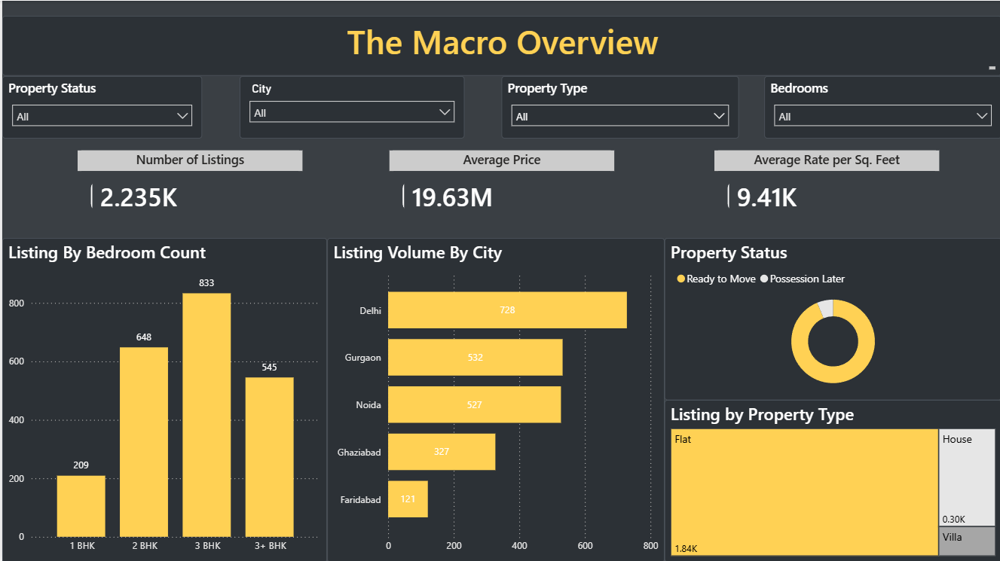
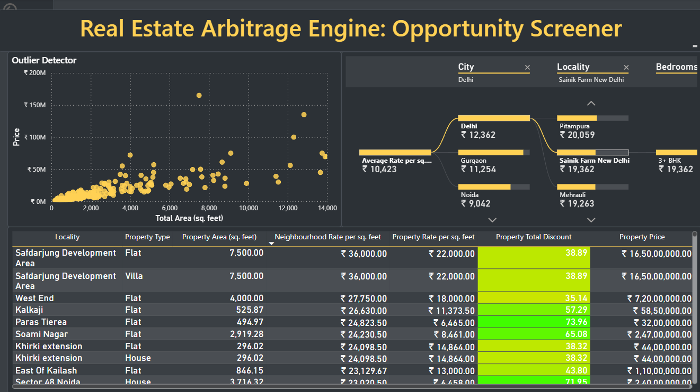

# Real Estate Arbitrage Engine (NCR Market)

## The Objective
Most real estate platforms simply display property costs. This project was built to show investors what properties are actually *worth*. 

I engineered an automated data pipeline that ingests raw real estate listings, normalizes them into a Star Schema, and uses SQL and Power BI to calculate neighborhood-specific baselines. The engine automatically flags individual properties listed significantly below market average (Arbitrage Opportunities) across the National Capital Region (NCR).

## The Final Product

### 1. Macro Market Overview

### 2. The Arbitrage Screener

##  Tech Stack & Workflow
1. **Data Extraction & Cleaning:** Python (BeautifulSoup, Pandas, NumPy)
2. **Database Architecture:** MySQL (DDL, DML, Star Schema Normalization)
3. **Business Logic & Aggregation:** Advanced SQL (Views, CTEs, Window Functions)
4. **Business Intelligence & UI:** Power BI (DAX, Data Modeling, Conditional Formatting)

## Data Architecture (Star Schema)
To ensure optimal query performance and eliminate text redundancy, the raw dataset was normalized into a Star Schema:
* **`Fact_Listings`**: The core transactional table holding quantitative metrics (Price, Area, Rate_Per_SqFt).
* **`Dim_Location`**: Dimension table containing 1,600+ unique City/Locality combinations.
* **`Dim_Property_Details`**: Dimension table managing 300+ unique structural configurations (BHK, Status, Type).

## Key Business Insights
* **The Gurgaon Anomaly:** Despite maintaining the highest average market rates in the region, specific micro-markets in Gurgaon (e.g., Sector 104) consistently contain the highest volume of heavily discounted (>20%) listings. 
* **Area vs. Price Outliers:** The interactive scatter plot successfully isolates large square-footage properties priced significantly beneath the regional trendline, flagging them for immediate visual review by capital allocators.

## Repository Navigation
* `data/`: Raw and cleaned datasets.
* `scripts_python/`: Web scraping and data manipulation notebooks.
* `sql_queries/`: Database creation and arbitrage logic Views.
* `dashboard/`: The Power BI `.pbix` file.
